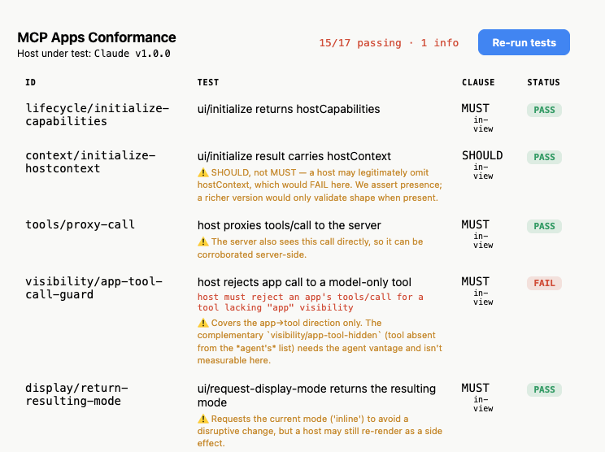

# MCP Apps Conformance



A **host-conformance test runner for the MCP Apps spec** ([SEP-1865 · `2026-01-26`](https://github.com/modelcontextprotocol/ext-apps/blob/main/specification/2026-01-26/apps.mdx), extension id `io.modelcontextprotocol/ui`), modeled on [web-platform-tests](https://web-platform-tests.org).

It ships a single `ui://` test page that renders **inside the host's sandboxed iframe**, drives the `postMessage`/JSON-RPC bridge, asserts the host's behaviour against the spec, and shows `PASS`/`FAIL` right in the iframe.

> **The host is the browser. The `ui://` page is the WPT test. The bridge is `testharness.js`.**

## Try it against a host

Connect this MCP server to the host you want to test, then prompt the host to run the suite:

- **Server URL:** `https://mcp-apps-conformance.alpic.live/mcp`
- **Prompt:** *“Run the MCP Apps conformance test suite against this host using the `run_conformance` tool, then I'll click Run.”*

The host renders the runner; click **Run conformance tests** to see results. Full walkthrough → **[How to run against your host](docs/how-to/run-against-your-host.md)**.

**Status:** 20 of 45 host requirements implemented (mostly `in-view`, plus two interactive `· manual` checks).

## Documentation

| Doc | What it's for |
|-----|---------------|
| [How to run against your host](docs/how-to/run-against-your-host.md) | Connect the server to a host and run the suite (start here) |
| [Host conformance catalogue](docs/reference/catalogue.md) | Every host requirement — its clause, vantage, and status |
| [How the conformance model works](docs/explanation/conformance-model.md) | The WPT analogy, the vantage model, the trust model, and what's deferred |
| [Strategy & open questions](docs/strategy-and-open-questions.md) | Draft for the working group — the trust-test and results-storage problems |

## Scope

POC: the **runner only** — results render in the iframe; nothing is persisted or aggregated. Cross-host result collection, a comparison grid, and server-side judging are future work (see [what's deferred](docs/explanation/conformance-model.md#whats-deferred-beyond-the-poc)).

## Develop

```bash
npm install
npm run build      # bundles the view (dist/view/index.html) + builds the server
npm run start      # http://localhost:3000/mcp
# or: npm run dev  # watch mode
```

- `server/` — reference MCP server (Streamable HTTP `/mcp`, Node-only; deploys on Alpic via `alpic deploy`)
- `view/` — React runner (ext-apps `useApp`) + `testharness.ts` (the `mcp_test()` harness) + `tests.ts` (the catalogue)
